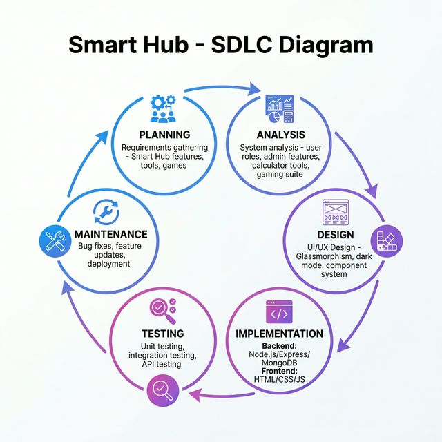
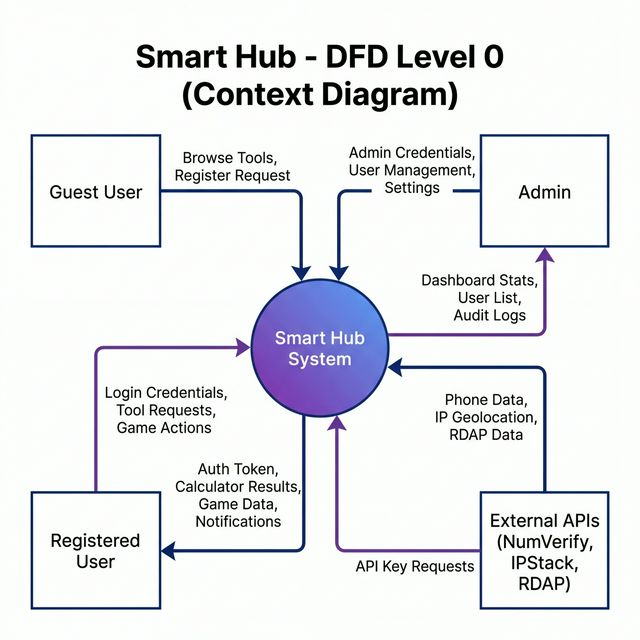
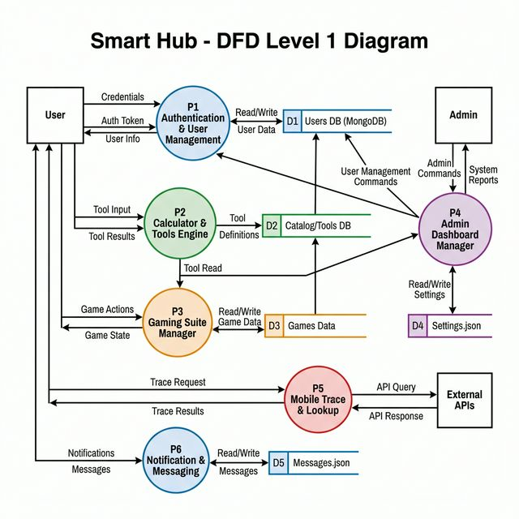
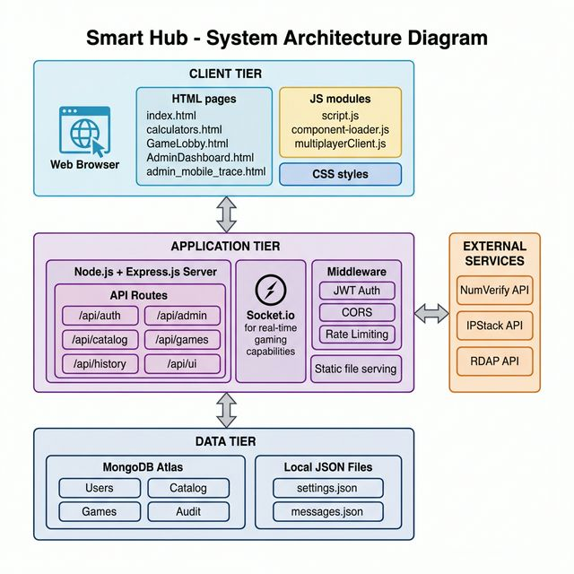
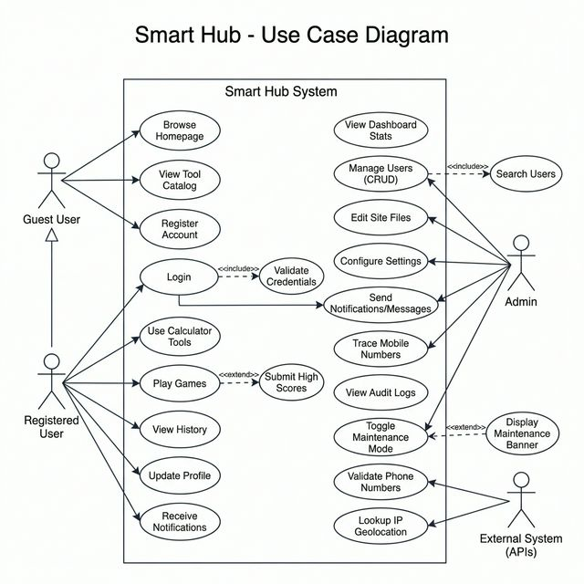
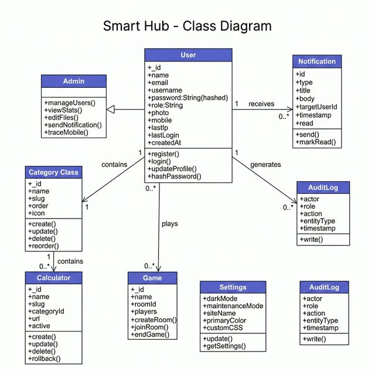
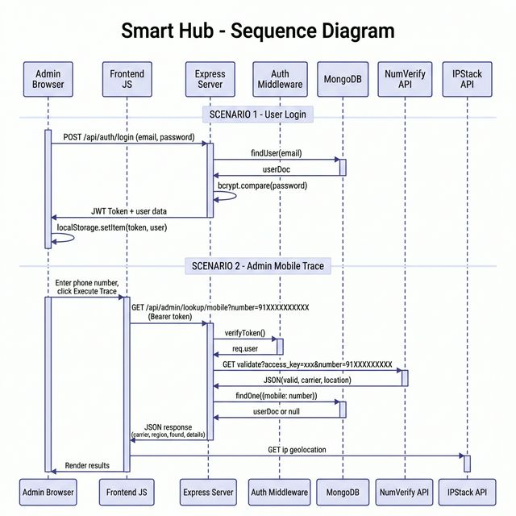

# Smart Hub — Project Diagrams

All diagrams are generated based on the actual Smart Hub codebase.

---

## 1. 🔄 SDLC Diagram

---

## 2. 🌐 DFD Level 0 — Context Diagram

---

## 3. 📋 DFD Level 1 Diagram

---

## 4. 🏗️ System Architecture Diagram

---

## 5. 👤 Use Case Diagram

---

## 6. 🧩 Class Diagram

---

## 7. ⏱️ Sequence Diagram

